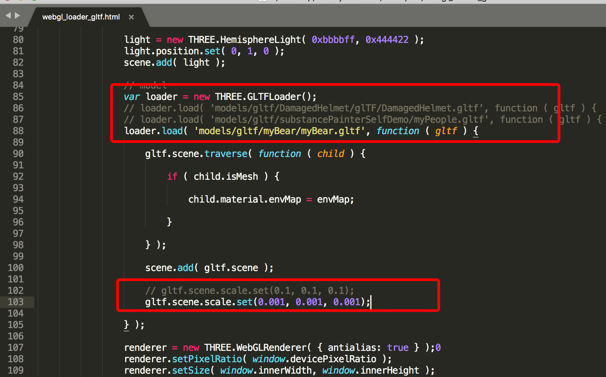

# substance painter export gltf in webgl(three.js) is totally black

##trouble 1

When I import my model (.fbx) to draw a texture in the substance painter and export it to the .gltf format, I find that the metal I paint is gone and replaced by the shiny black, and then when I put the exported model in the three.js/examples/webgl_load_gltf.html case, I found that my model was dark and needed to be added a directLight can only see a point, the effect is not very good, but the case of importing the substance painter does not have any problems.

It looks as good as the model in the original example.

I would like to know what causes this two problems.

this is copied from substance painter's samples, named **MeetMat.spp** and I renamed myPeople.spp

 and this is my fbx, I build it in blender
 
 
 and put it in substance painter, saved with **myBear.spp**

and then I export all them to `.gltf` in `/examples/models/gltf`

I use them in `/examples/webgl_loader_gltf.html` like this

this model is gltf come from substance painter's inner demo

and this use the gltf come from my fbx

###final result

gltf com from substance painter innder demo

gltf come from my fbx

> Note:
> 
> I just change the model , no other else

## touble 2

when I use <a href='https://gltf-viewer.donmccurdy.com'>https://gltf-viewer.donmccurdy.com</a> to watch the gltf I buld, also have some different

gltf com from substance painter innder demo

gltf come from my fbx

